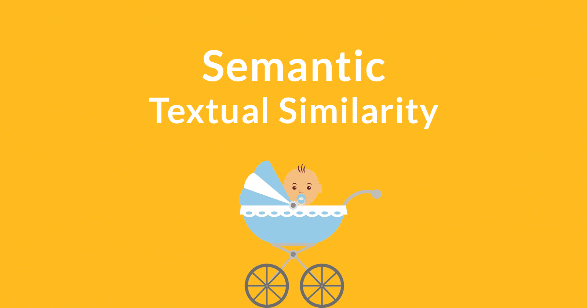

# semantic-textual-similarity

Rank23 in AI Talks Competitions.. Long way to go to become a NLPer...

# Datasets
[AI Talks Competitions](https://ai.ppdai.com/mirror/goToMirrorDetail?mirrorId=1&tabindex=1): predict whether a pair of questions are duplicates or not, and submitting a binary prediction against the logloss metric. 

# License
This project is licensed under the terms of the MIT license.
